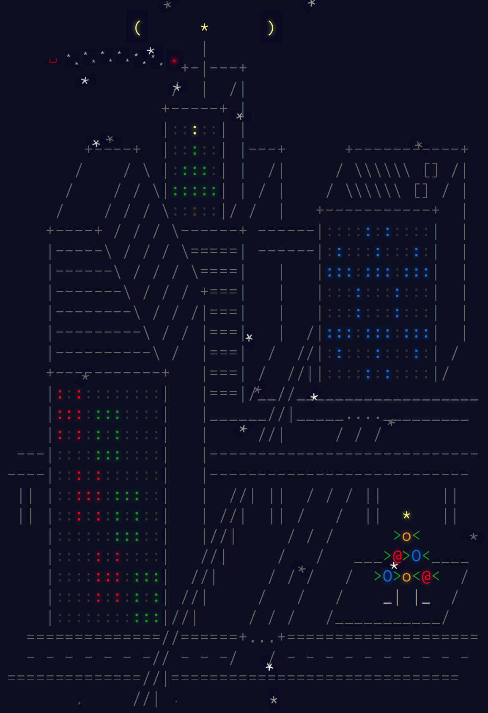

Advent of Code - OCaml
=======================

Once again, I participated in Advent of Code, which is a collection of 25 programming challenges, one for each day leading up to Christmas. More information [here](http://adventofcode.com/about).

I thought that over the course of these 25 challenges, I could brush up on a language that I haven't worked with in a while – OCaml!

Notes
-----

Each solution reads input from stdin and outputs the answer for the day and associated part.

>   `make p1` will give the solution for part 1  
    `make p2` will give the solution for part 2

---

**MERRY CHRISTMAS!**

